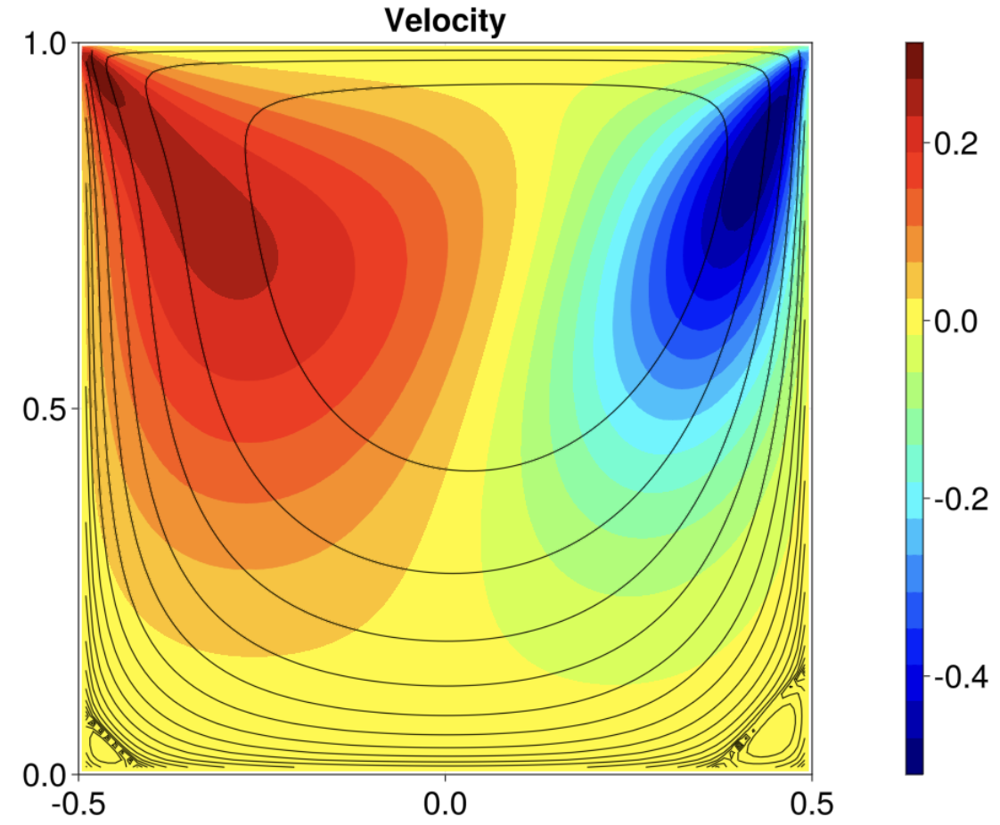

# LidCavity

Lid driven cavity in PT fashion for laminar flow regimes (Re < ~2000). For turbulent flow, check out [NavierStokes.jl](https://github.com/utkinis/NavierStokes.jl).

## Output

Result for Reynolds number `Re = 100`

    

